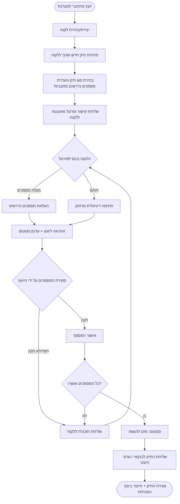
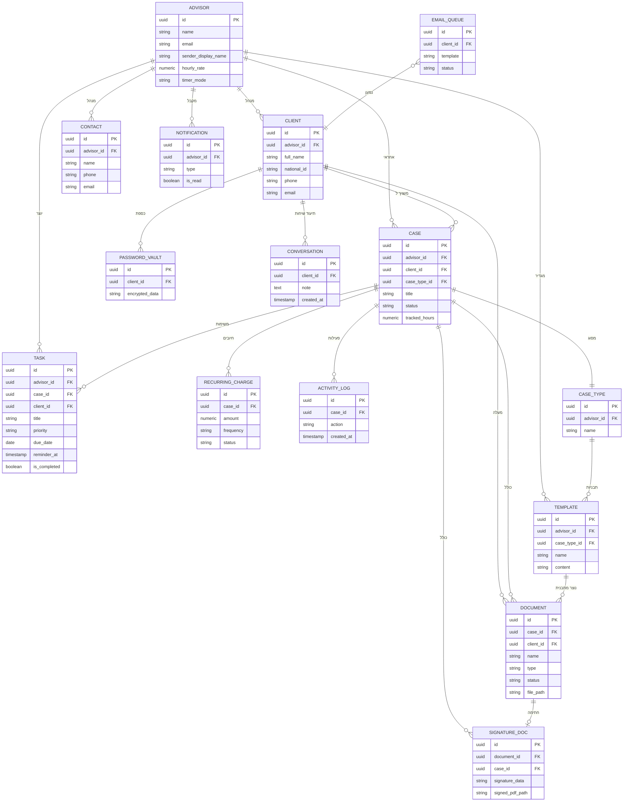

# תרשימי מערכת — EasyDocs

> תרשימים בפורמט Mermaid. ניתן לצפות בהם ב‑VS Code (תצוגה מקדימה של Markdown), ב‑GitHub, או בכל עורך התומך ב‑Mermaid.

---

## 1. תרשים זרימה: תהליך פתיחת תיק

---

## 2. דיאגרמת ישויות (ERD)

---

> הערה: שמות השדות וההיררכיה הם ברמת אפיון על‑בסיס מבנה המערכת. שמות עמודות מדויקים עשויים להשתנות מעט במימוש בפועל.
